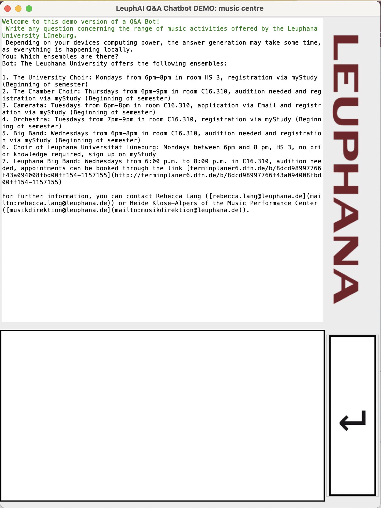

### LeuphAI Q&A Chatbot Demo
Studying can be very hard, right? There is so much to do, even after a whole year, I still discover things I wish I knew when I was starting out. Think of all the clubs, the sports teams, the ways of handling your curriculum... Well, now, there is a solution. 
LeuphAI is a Chatbot providing answers related to studying at Leuphana University in Lüneburg. It comes with a TKinter GUI. This project is only a demo version focusing on issues concerning the musical ensembles of the university. I could not create a full version as I don't have the computing power on my device to run the context of the entire Leuphana website on my computer. There are also some files highlighting the paths I took creating this demo.


#### Installation
You just need to install all dependencies from the requirements file like this:

```
pip install -r requirements.txt
```

#### Usage
I also put older and test versions of my code into this repository, but for the commplete final project, you just need to run the following file like this:
```
python main.py
```
---
ENJOY!!!
